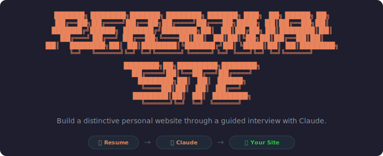

<p align="center">
  
</p>

# personal-site

Build a distinctive personal website through a guided interview with Claude. No HTML required. Walks you through resume intake, picking a palette from ten 2026 color directions, choosing a headline font, generating the files, QA'ing the content against your real story, and getting the whole thing live on GitHub Pages for free.

Designed not to look like every other AI-built site. Ships a real editorial backbone (not a prompt) and a strict "do not use" list to keep generated output from drifting into generic AI defaults.

## Install

1. Download the latest `personal-site.plugin` from [Releases](../../releases).
2. Open the Claude desktop app and turn on Cowork.
3. Drop the `.plugin` file in.

That's it. Then start a new Cowork session and say "build me a personal site" or run `/personal-site`.

## What it does

A typical session takes about an hour and looks like this:

- Three-question interview about the site's purpose, audience, and where you are in life
- Resume intake (paste it or drop a file)
- Quick voice check (casual or formal, dry or warm, what you don't want to sound like)
- Pick from ten 2026 color palettes shown as inline chips with hex codes
- Pick a headline font from four distinctive options (no Inter, no Geist)
- Drop in a photo and your scheduling link
- Claude generates `index.html`, `design-system.md`, and a tailored `START-HERE.md` guide in your folder
- Walks you through QA'ing every section against your resume
- Walks you through getting it live on GitHub Pages, optionally pointing a $10 domain at it, and connecting Claude to GitHub so future edits push live with one sentence
- Reminds you to test on your phone and tells you what to look for
- Adds free analytics with a clever resume-tracking trick (`?ref=resume` shows up as a source so you can see when recruiters click through)

## Why this exists

Most AI-built sites have a tell. The same Inter font, the same pill buttons, the same icon-card grids, the same testimonial carousels, the same drop shadows. This plugin fights that on four fronts:

- A bundled backbone instead of generating from scratch. The structural layout, type system, color-zoned chapters, and mobile patterns ship with the plugin and don't drift.
- A bundled design system with an explicit "do not use" list that Claude reads first every session.
- Hard reliance on the user's specifics. The interview, resume read, and voice check force user-true content into the copy.
- A post-generation slop check that greps the output for known tells and fixes anything caught.

## What's inside the plugin

```
personal-site/
├── .claude-plugin/plugin.json
├── skills/build-personal-site/
│   ├── SKILL.md            the behavior file Claude follows
│   └── references/
│       ├── index.html      the editorial backbone
│       ├── design-system.md   the rulebook + the do-not-use list
│       ├── START-HERE.md   the user-facing guide template
│       └── palettes.md     the ten 2026 palettes with hexes
├── README.md
└── LICENSE
```

## License

MIT. See [LICENSE](LICENSE).
